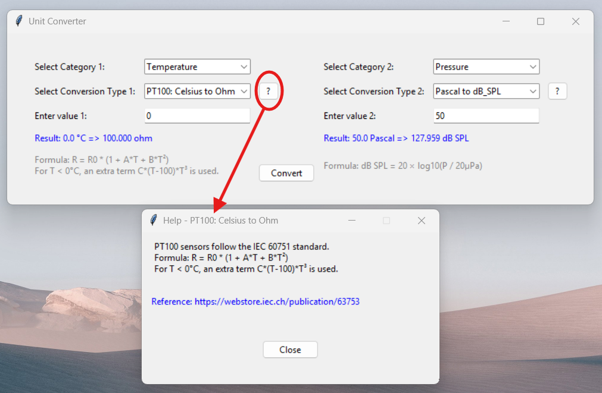

# Unit Converter

A simple GUI-based unit converter built with Tkinter. This application allows users to convert various units across different categories, including temperature, pressure, length, mass, and volume.

## Features
- Convert between different measurement units
- Support for temperature (Celsius, Fahrenheit, Kelvin, PT100 resistance), pressure, length, mass, and volume
- Built-in help system for conversion formulas
- User-friendly graphical interface

## Preview


## Installation
### Prerequisites
Ensure you have Python installed on your system. You can download it from [python.org](https://www.python.org/).

### Clone the Repository
```sh
git clone https://github.com/MaximeBond/Unit-Converter.git
cd Unit-Converter
```

### Install Dependencies
The application only requires Tkinter, which is included by default in standard Python installations.

## Usage
Run the following command to start the application:
```sh
python unit_converter.py
```

### Executable (Windows) ⚡
If you're using Windows, you can directly download and use the `.exe` file in the `dist` folder!

## License
This project is licensed under the MIT License, meaning you are free to use, modify, and distribute it as long as you include the original license. See the [LICENSE](LICENSE) file for details.

## Author
Maxime Bonnaud
